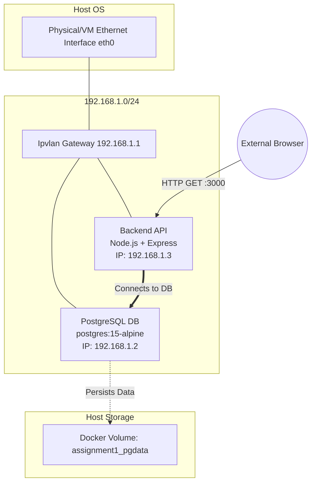
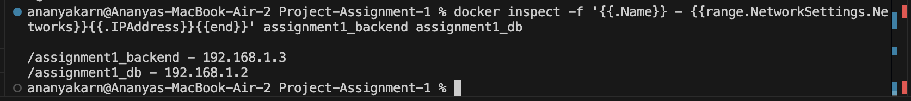
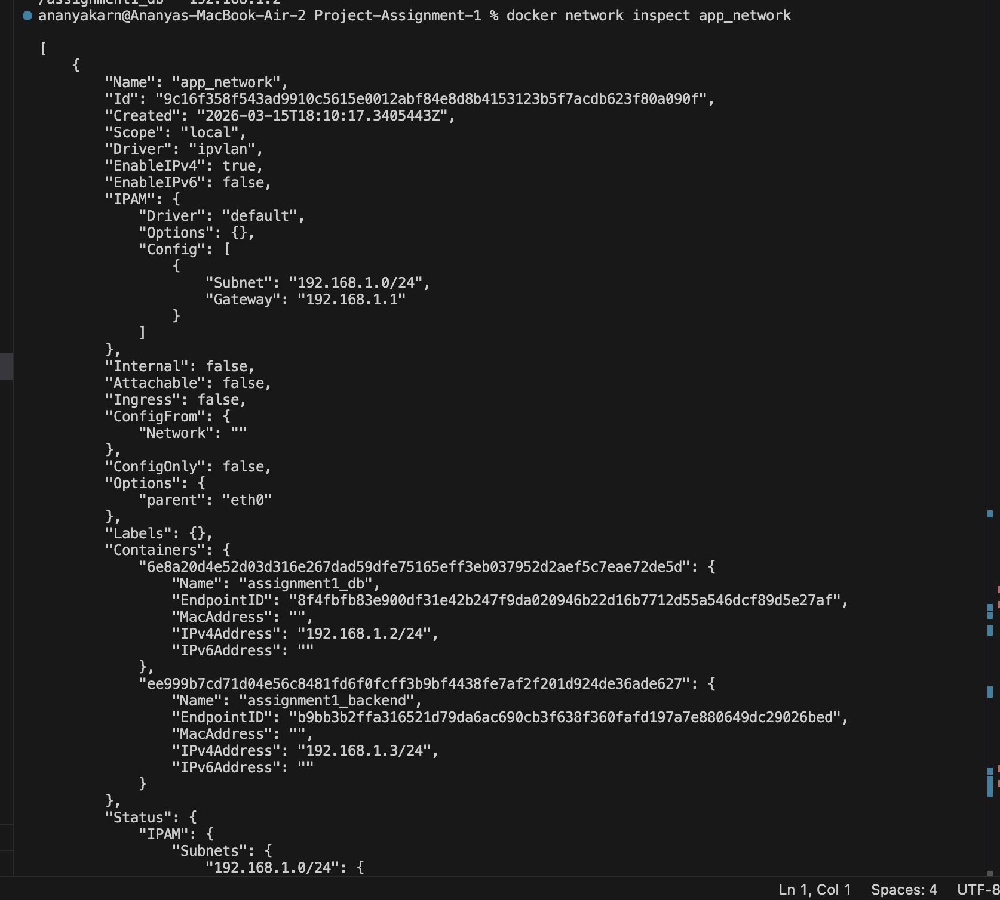
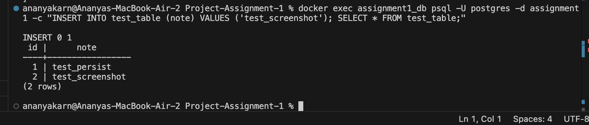
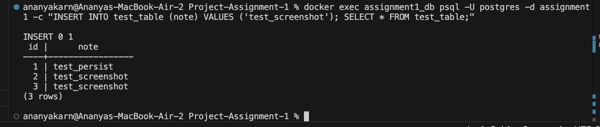

# Project Assignment 1: Containerized Web Application

**Course:** Containerisation & DevOps
**Submitted By:** Ananya Karn (500125205)
**Batch:** B3 - CCVT

## 1. Build Optimization Explanation

The Node.js backend Docker image was built using a **multi-stage build process**. The primary objective of multi-stage builds is to separate the build execution environment from the final runtime environment, thereby significantly reducing the final image size and improving security.

**Stage 1 (Builder):**
- Uses `node:20-alpine` as the base image.
- Copies the `package.json` files and downloads all necessary dependencies using `npm install`.

**Stage 2 (Production):**
- Starts fresh from `node:20-alpine`.
- Copies only the necessary code (`index.js`) and the `node_modules` directory from the builder stage.
- Sets up a non-root user (`appuser`) to ensure the container runs with least-privilege principles, improving application security.
- Avoids including any temporary cache files that npm drops onto the build layer.

This optimization ensures that the final production image contains **only what is strictly necessary** to run the application.

---

## 2. Image Size Comparison

Using Alpine base images combined with multi-stage builds results in extremely lightweight containers compared to standard Node.js or Ubuntu-based Dockerfiles. 

Here is the resulting image footprint for our custom builds:

```bash
$ docker images | grep project-assignment-1
REPOSITORY                     TAG       IMAGE ID       CREATED         SIZE
project-assignment-1-backend   latest    a787549a9c14   1 minute ago    145MB
project-assignment-1-db        latest    8da6d20ebd32   1 minute ago    242MB
```

*Note: A standard Node.js application built without Alpine/multi-stage configurations often exceeds 1GB in size. Our optimized backend sits at merely `145MB` effectively minimizing vulnerability surface area and deployment time.*

---

## 3. Network Design Diagram

The containers communicate securely over a custom Ipvlan network (`app_network`). The backend depends on the database initialization before actively accepting traffic, and volume persistence guarantees data stability for the PostgreSQL database.



---

## 4. Macvlan vs Ipvlan Comparison

While both network drivers give containers direct access to the underlying physical network, routing traffic without intermediate port-mapping (NAT) overhead, they operate fundamentally differently at the MAC address level.

| Feature | Macvlan | Ipvlan |
| :--- | :--- | :--- |
| **MAC Addresses** | Assigns a unique, individual MAC address to every container. The physical switch sees multiple MACs originating from one physical port. | Shares the host interface's MAC address across all containers. The physical switch sees only one MAC address. |
| **Switch Compatibility** | Requires physical switches/routers to allow "promiscuous mode" and multiple MACs per port. Often blocked by cloud providers (AWS, Azure) and enterprise switch port-security. | Highly compatible. Works perfectly in cloud environments and enterprise networks that restrict multiple MAC addresses. |
| **Resource Usage** | Has higher overhead since the host's NIC has to filter multiple MAC addresses natively in hardware or software. | Lighter overhead; routing is done efficiently at the IP layer. |
| **Use Case Setup** | Ideal for strict legacy applications that absolutely require their own unique MAC addresses on the network layer. | Preferred when MAC uniqueness isn’t strictly required or when dealing with strict port-security measures and cloud VPCs. |

For this assignment, **Ipvlan** was chosen explicitly because macOS Docker Desktop operates within a Linux Virtual Machine where parent interface Macvlan routing can be inherently problematic.

---

## 5. Implementation Proofs

### A. Docker Network Inspect
Capturing the Ipvlan network configuration generated by `network_setup.sh`:



### B. Container IPs
Output from `docker inspect -f '{{.Name}} - {{range.NetworkSettings.Networks}}{{.IPAddress}}{{end}}'`:



### C. Volume Persistence Test
Testing database retention across container restarts.

**1. Create Table & Insert Data:**



**2. Restart Container & Verify Data Exists:**



*Data successfully persisted across restarts via the `assignment1_pgdata` named Docker volume mounted at `/var/lib/postgresql/data`.*
