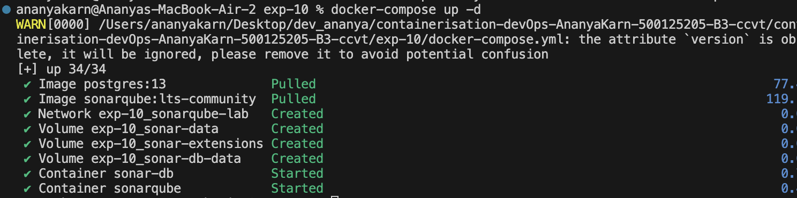
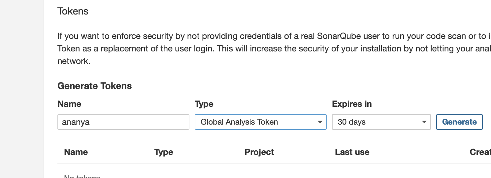
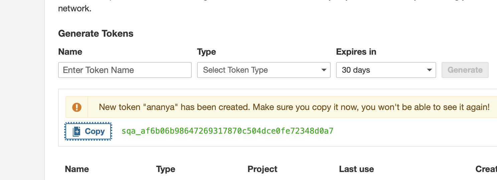
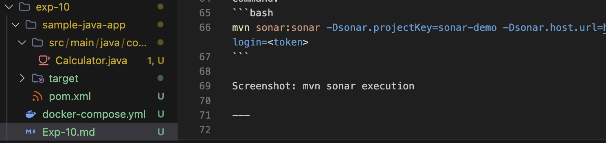
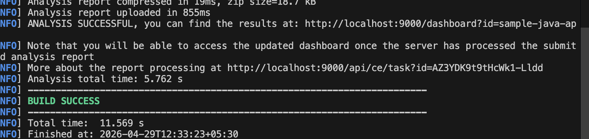
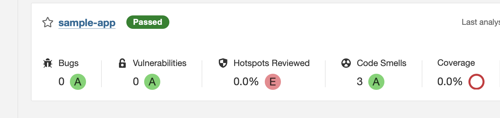

# Experiment 10: SonarQube Static Code Analysis

## Aim
To analyze source code using SonarQube and detect bugs, vulnerabilities, and code smells.

***

## Tools Used
- Docker
- Docker Compose
- SonarQube
- PostgreSQL
- Maven

***

## Steps Performed

### 1. Started SonarQube Server
- Used Docker Compose to run SonarQube and PostgreSQL

Command:
```bash
docker-compose up -d
```



***

### 2. Accessed Web UI
- Opened http://localhost:9000
- Logged in using admin/admin


***

### 3. Generated Authentication Token
- Created token in Security settings





***

### 4. Created Java Project
- Built a sample application with intentional issues

Command:
```bash
mvn archetype:generate -DgroupId=com.example -DartifactId=sonar-demo -DarchetypeArtifactId=maven-archetype-quickstart -DinteractiveMode=false
```

Screenshot: Project structure


***

### 5. Ran Sonar Scanner
- Used Maven plugin to scan project

Command:
```bash
mvn sonar:sonar -Dsonar.projectKey=sonar-demo -Dsonar.host.url=http://localhost:9000 -Dsonar.login=<token>
```



***

### 6. Viewed Results
- Observed bugs, vulnerabilities, and code smells in dashboard

Screenshot: SonarQube dashboard


***

## Observations
- SonarQube detects bugs without running code
- Provides maintainability insights
- Helps improve code quality
- Supports multiple languages

***

## Result
Successfully performed static code analysis using SonarQube and identified issues in the sample Java application.

***

## Questions

1. What is SonarQube?
→ Tool for static code analysis

2. What is static analysis?
→ Checking code without execution

3. What is a Quality Gate?
→ Rules code must pass before deployment

4. Difference between bug and code smell?
→ Bug = error, smell = poor design

5. Why token is used?
→ Secure authentication

***

## Conclusion
SonarQube provides an efficient way to detect code issues early, improving software quality and maintainability
