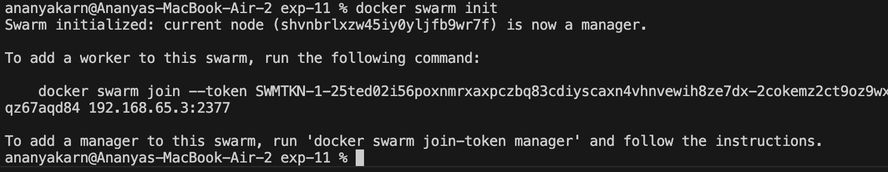
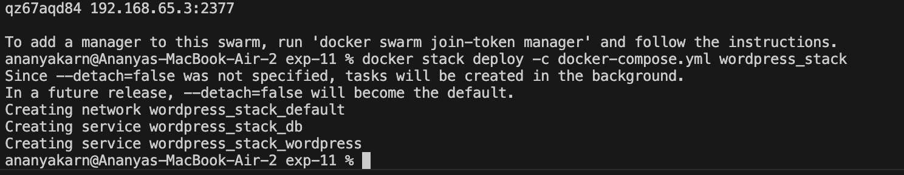
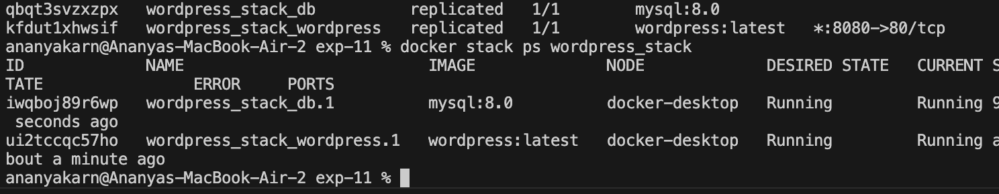
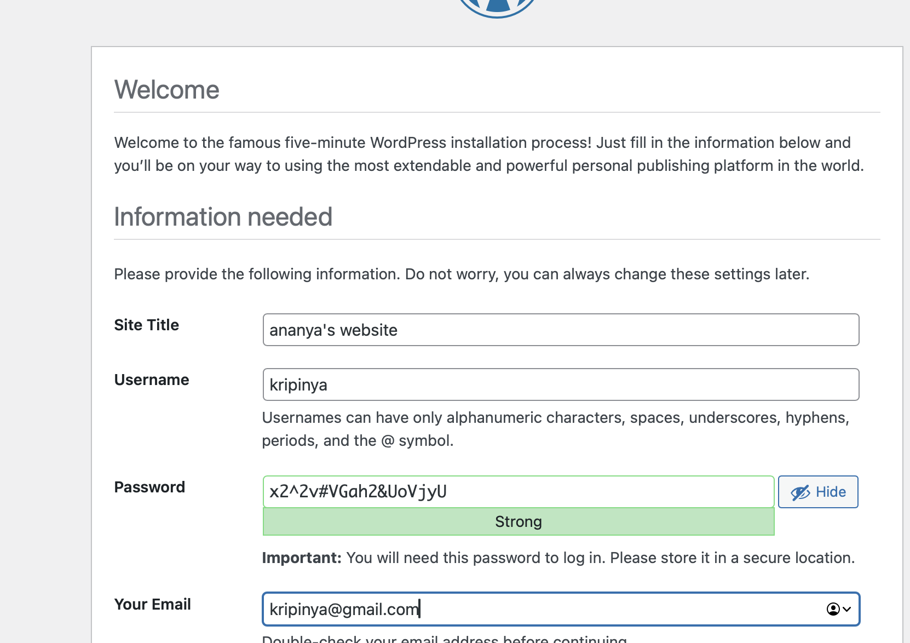
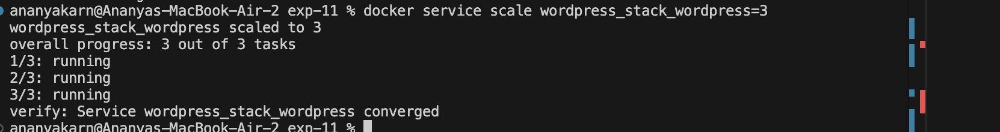

# Experiment 11: Container Orchestration using Docker Swarm

## Aim
To understand and implement container orchestration using Docker Swarm.

***

## Tools Used
- Docker
- Docker Compose
- Docker Swarm

***

## Steps Performed

### 1. Stopped Existing Containers
Before starting the experiment, existing containers were stopped to clean the environment.

Command:
```bash
docker compose down
```

***

### 2. Initialized Docker Swarm
Docker Swarm mode was enabled on the local machine to act as a manager node.

Command:
```bash
docker swarm init
```



***

### 3. Deployed Stack
The application stack (WordPress and MySQL) was deployed using a compose file.

Command:
```bash
docker stack deploy -c docker-compose.yml wordpress_stack
```




***

### 4. Verified Services
The status of the deployed services and containers was verified.

Commands:
```bash
docker service ls
docker stack ps wordpress_stack
```



***

### 5. Accessed Application
The WordPress application was accessed through the browser to verify successful deployment.

URL:
```text
http://localhost:8081
```



***

### 6. Scaled Application
The WordPress service was scaled to 3 replicas to demonstrate load balancing and high availability.

Command:
```bash
docker service scale wordpress_stack_wordpress=3
```



***

### 7. Tested Self-Healing
A running container was manually removed to observe Docker Swarm's automatic self-healing capability.

Command:
```bash
docker rm -f <container_id>
```
*Observation: Swarm immediately detected the failure and provisioned a new container to maintain the desired state.*


***

### 8. Removed Stack
The stack was removed to clean up resources after the experiment.

Command:
```bash
docker stack rm wordpress_stack
```


***

## Observations
- Docker Swarm manages container lifecycles automatically.
- Scaling services is efficient and requires only a single command.
- Built-in load balancing distributes traffic across replicas.
- Self-healing ensures application reliability by recreating failed containers.

***

## Result
Successfully implemented container orchestration using Docker Swarm, including stack deployment, scaling, and self-healing.

***

## Questions

1. What is orchestration?
→ Automatic management of container lifecycles, including deployment, scaling, and networking.

2. Difference between Compose and Swarm?
→ Docker Compose is used for managing multi-container applications on a single host, while Docker Swarm is used for orchestrating containers across a cluster of nodes.

3. What is scaling?
→ Increasing or decreasing the number of container replicas to handle varying traffic loads.

4. What is self-healing?
→ The ability of an orchestrator to automatically restart or replace failed containers to maintain the desired state.

5. What is load balancing?
→ The distribution of incoming network traffic across multiple containers to ensure no single container is overwhelmed.

***

## Conclusion
Docker Swarm provides an efficient and simplified approach to container orchestration, offering essential features like scaling, automated load balancing, and self-healing to maintain application availability.
