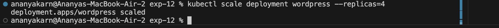
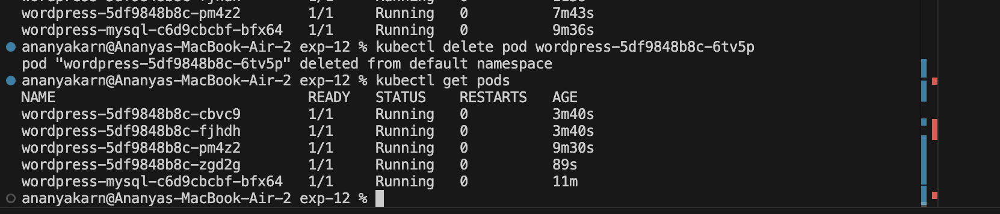

# Experiment 12: Kubernetes Container Orchestration

## Aim
To study and implement container orchestration using Kubernetes.

---

## Tools Used
- Kubernetes
- kubectl
- Minikube

---

## Steps Performed

### 1. Started Kubernetes Cluster
The local Kubernetes cluster was initialized using Minikube.

Command:
```bash
minikube start
```


---

### 2. Created Deployment
A WordPress deployment was defined and applied to the cluster with an initial configuration of 2 replicas.

Command:
```bash
kubectl apply -f wordpress-deployment.yaml
```


---

### 3. Created Service
The deployment was exposed externally using a NodePort service to allow access to the application.

Command:
```bash
kubectl apply -f wordpress-service.yaml
```


---

### 4. Verified Resources
The status of the pods and services was checked to ensure everything was running correctly.

Commands:
```bash
kubectl get pods
kubectl get svc
```


---

### 5. Accessed Application
The WordPress application was accessed using the URL provided by Minikube service tunnel.

Command to get URL:
```bash
minikube service wordpress-service --url
```


---

### 6. Scaled Deployment
The number of replicas in the deployment was increased from 2 to 4 to demonstrate dynamic scaling.

Command:
```bash
kubectl scale deployment wordpress --replicas=4
```




---

### 7. Tested Self-Healing
A pod was manually deleted to observe Kubernetes' automatic self-healing capability as it recreates the pod to maintain the desired state.

Command:
```bash
kubectl delete pod <pod_name>
```



---

## Observations
- Kubernetes automates the management and scheduling of pods across the cluster.
- Scaling is dynamic and can be performed with a single command without downtime.
- Services provide a stable network endpoint for accessing pods even as they are recreated.
- Self-healing ensures high availability by automatically restarting failed or deleted pods.

---

## Result
Successfully deployed and managed a containerized application using Kubernetes, demonstrating core features such as scaling and self-healing.

---

## Questions

1. What is a Pod?
→ The smallest and simplest unit in the Kubernetes object model that represents a single instance of a running process in your cluster.

2. What is Deployment?
→ An object that manages a replicated application, providing declarative updates for Pods and ReplicaSets.

3. What is Service?
→ An abstraction which defines a logical set of Pods and a policy by which to access them, often used to expose an application.

4. What is ReplicaSet?
→ A core Kubernetes controller that ensures a specified number of pod replicas are running at any given time.

5. Difference between Swarm and Kubernetes?
→ While Docker Swarm is simpler to set up and integrated into Docker, Kubernetes is more advanced, offering complex scheduling, extensive customization, and is considered the industry standard for orchestration.

---

## Conclusion
Kubernetes provides a powerful and robust framework for container orchestration, offering advanced features for scalability, self-healing, and service discovery that are essential for cloud-native applications.
