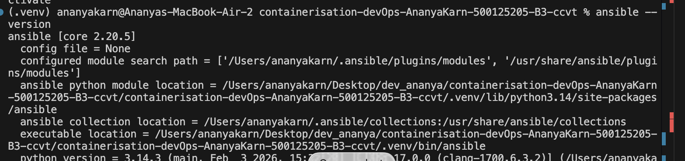
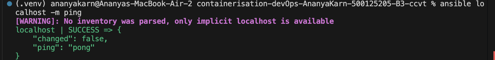
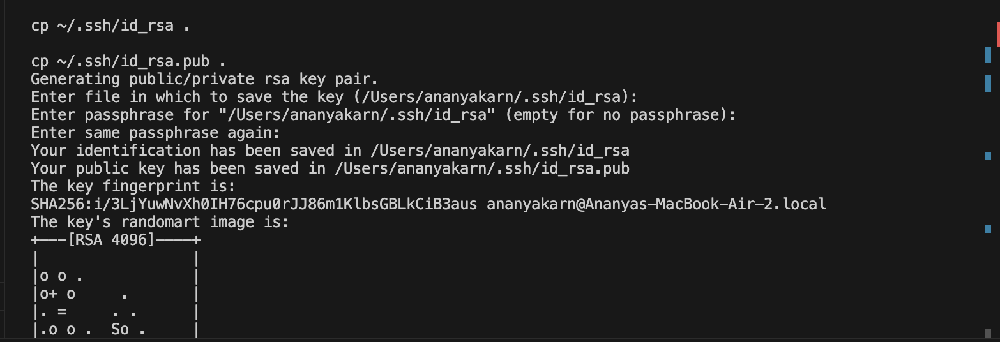
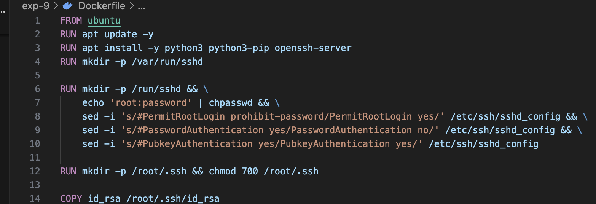
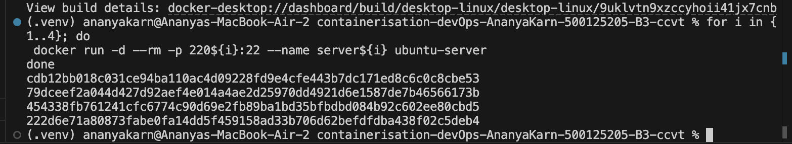
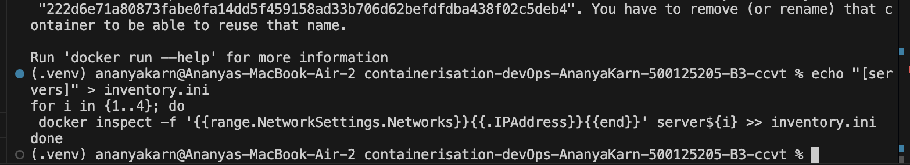
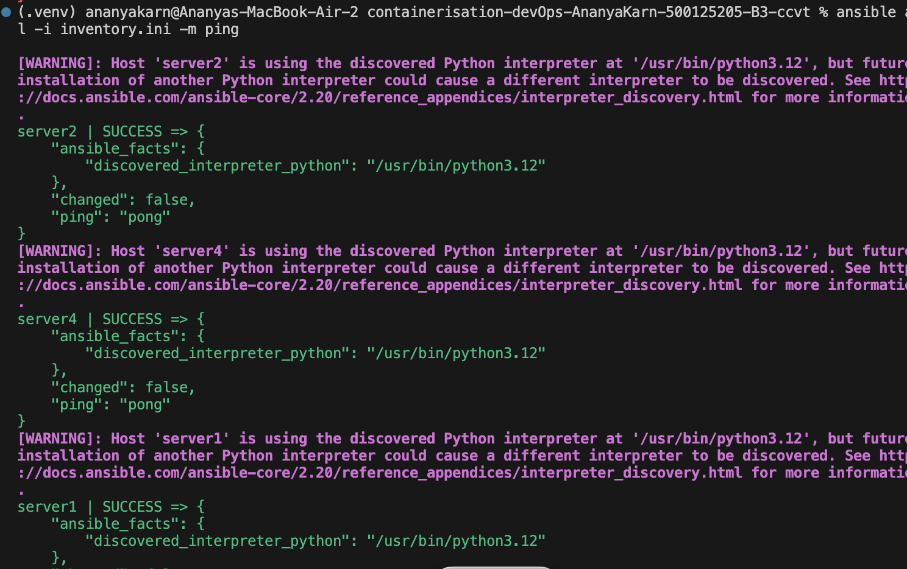
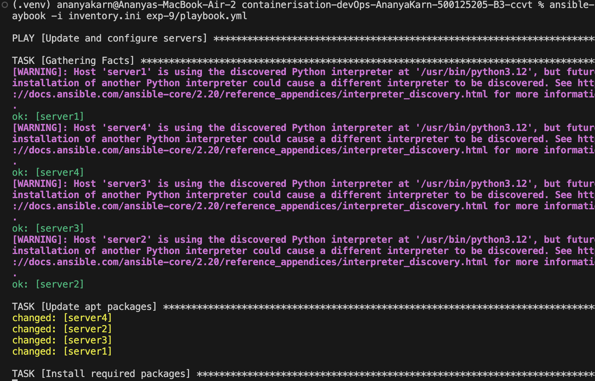
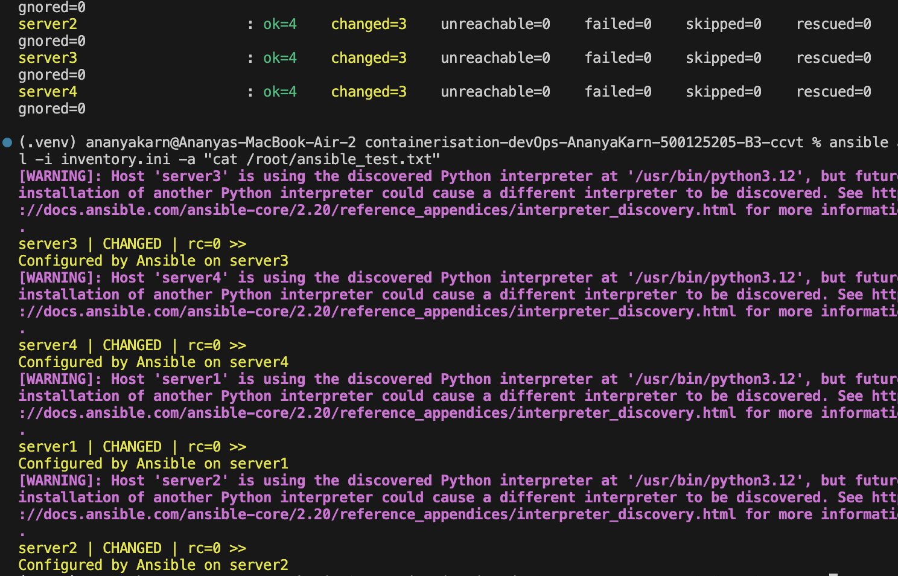

# Experiment 9: Ansible Automation with Docker

## Aim
The goal of this experiment is to automate server configuration using Ansible by managing multiple Docker-based servers.

## Objectives
- Understand Ansible architecture
- Use SSH-based automation
- Create inventory and playbooks
- Configure multiple servers automatically

## Tools Used
- Ansible
- Docker
- Ubuntu
- SSH

## Steps Performed

### 1. Installed Ansible
Ansible was installed on the control node. After installation, the setup was verified using the ping module to ensure it was functional.



**Commands used:**
```bash
sudo apt update
sudo apt install ansible -y
ansible localhost -m ping
```



### 2. Generated SSH Key Pair
An SSH key pair was generated to allow the Ansible control node to communicate securely with the managed nodes without requiring passwords.

**Commands used:**
```bash
ssh-keygen -t rsa -b 2048 -f ~/.ssh/id_rsa -N ""
```



### 3. Created Docker Image
A custom Docker image was created using a Dockerfile. This image is based on Ubuntu and includes an SSH server, allowing it to be managed by Ansible.

**Dockerfile content:**
```dockerfile
FROM ubuntu:latest
RUN apt update && apt install openssh-server -y
RUN mkdir /var/run/sshd
RUN echo 'root:root' | chpasswd
RUN sed -i 's/#PermitRootLogin prohibit-password/PermitRootLogin yes/' /etc/ssh/sshd_config
RUN ssh-keygen -A
EXPOSE 22
CMD ["/usr/sbin/sshd", "-D"]
```

**Commands used:**
```bash
docker build -t ansible-node .
```

(Screenshot: Dockerfile)


### 4. Launched Multiple Containers
Four containers were launched from the custom image to act as managed servers.

**Commands used:**
```bash
docker run -d --name server1 ansible-node
docker run -d --name server2 ansible-node
docker run -d --name server3 ansible-node
docker run -d --name server4 ansible-node
```



### 5. Created Inventory File
An inventory file was created to define the target servers and their connection details.

**Commands used:**
```bash
# Get container IP addresses
docker inspect -f '{{range .NetworkSettings.Networks}}{{.IPAddress}}{{end}}' server1
docker inspect -f '{{range .NetworkSettings.Networks}}{{.IPAddress}}{{end}}' server2
docker inspect -f '{{range .NetworkSettings.Networks}}{{.IPAddress}}{{end}}' server3
docker inspect -f '{{range .NetworkSettings.Networks}}{{.IPAddress}}{{end}}' server4

# Create inventory.ini
nano inventory.ini
```

**Inventory file content (example):**
```ini
[servers]
server1 ansible_host=172.17.0.2
server2 ansible_host=172.17.0.3
server3 ansible_host=172.17.0.4
server4 ansible_host=172.17.0.5

[servers:vars]
ansible_user=root
ansible_password=root
```



### 6. Tested Connectivity
The Ansible ping module was used to test the connection to all the managed nodes defined in the inventory.

**Commands used:**
```bash
ansible all -i inventory.ini -m ping
```



### 7. Created Playbook
A YAML playbook was created to define the tasks that need to be performed on the servers, such as installing packages and creating files.

**Commands used:**
```bash
nano playbook.yml
```

**Playbook content:**
```yaml
***
- hosts: all
  tasks:
    - name: Install vim package
      apt:
        name: vim
        state: present
    - name: Create a test file
      copy:
        content: "Ansible Test File"
        dest: /root/ansible_test.txt
```

### 8. Executed Playbook
The playbook was executed to apply the defined configuration across all four servers simultaneously.

**Commands used:**
```bash
ansible-playbook -i inventory.ini playbook.yml
```



### 9. Verified Results
The results were verified by checking for the existence and content of the test file on all servers.

**Commands used:**
```bash
ansible all -i inventory.ini -a "cat /root/ansible_test.txt"
```



## Workflow
Control Node (Ansible) -> Inventory -> Playbook -> Managed Nodes (Docker Containers)

## Observations
- Ansible significantly simplifies the management of multiple servers.
- The agentless architecture reduces the need for software installation on the managed nodes.
- YAML playbooks provide a readable and easy-to-understand format for defining tasks.
- Automation reduces manual effort and minimizes the risk of configuration errors.

## Result
Successfully automated the configuration of multiple servers using Ansible playbooks and Docker containers.

## Questions

1. What is Ansible?
Ansible is an open-source automation tool used for configuration management, application deployment, and task automation.

2. What is Inventory?
An inventory is a file that lists the managed nodes or hosts that Ansible will interact with.

3. What is Playbook?
A playbook is a YAML file where you define the tasks that Ansible should perform on the managed nodes.

4. Why is Ansible agentless?
Ansible is agentless because it uses standard SSH for communication, meaning no special software needs to be installed on the managed nodes.

5. What is idempotency?
Idempotency is a property where an operation can be applied multiple times without changing the result beyond the initial application.

## Conclusion
This experiment demonstrated how Ansible can effectively automate server configuration across multiple Docker containers. The results show that it is a scalable and efficient approach to infrastructure management.
