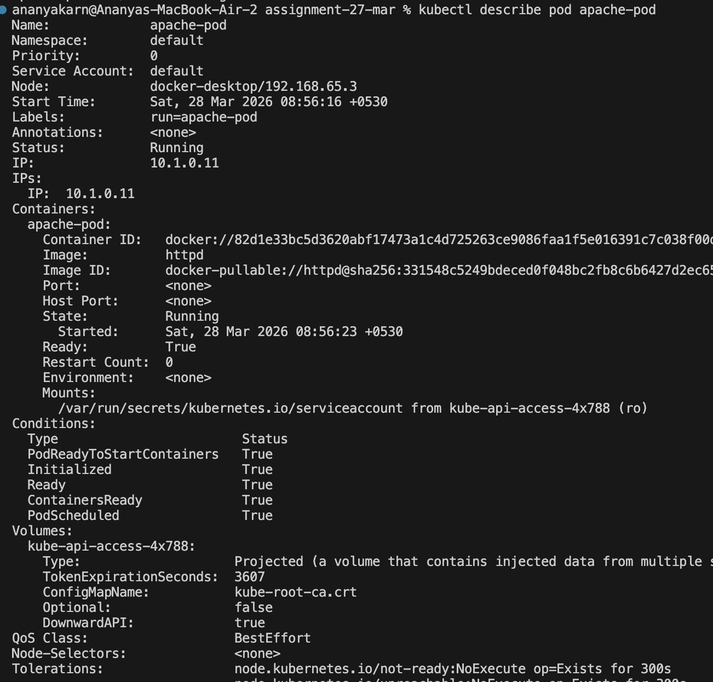
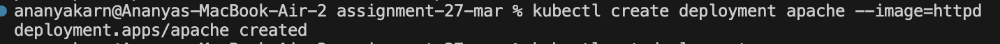
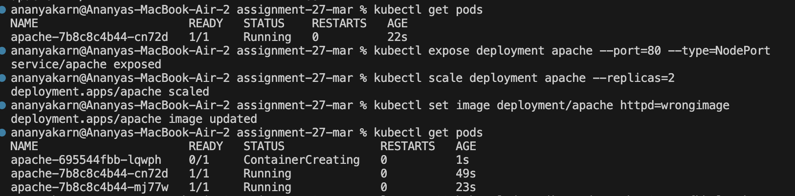
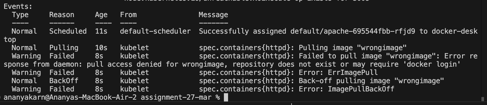
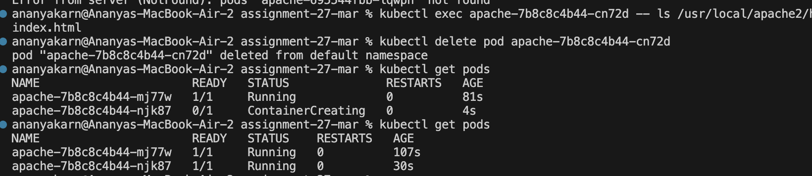

# Experiment: Run and Manage a “Hello Web App” (Apache httpd) on Kubernetes

## Objective
Deploy and manage a simple Apache-based web server to master:
- **Kubernetes Pod Lifecycle**
- **Self-Healing Capabilities**
- **Scaling and Load Handling**
- **Deployment Management and Debugging**

***

## Step-by-Step Implementation

### **Phase 1: Running a Standalone Pod**
**Step 1: Create the Pod**
```bash
kubectl run apache-pod --image=httpd
```
*Result:* Running a single container directly using the Apache image.


**Step 2: Inspect the Pod**
```bash
kubectl describe pod apache-pod
```
*Observation:* Found image `httpd` and port `80`. Events showed scheduling and image pull status.



**Step 3: Access the App**
```bash
kubectl port-forward pod/apache-pod 8081:80
```
*Verification:* Accessed `http://localhost:8081` and saw the official "It works!" page.


**Step 4: Delete the Pod**
```bash
kubectl delete pod apache-pod
```
*Insight:* The pod disappeared permanently. Standalone pods do **not** self-heal.

***

### **Phase 2: Working with Deployments (Self-Healing & Scaling)**

**Step 5: Create a Deployment**
```bash
kubectl create deployment apache --image=httpd
```
*Result:* Managed pods recreate themselves if they fail or are deleted.




**Step 6: Expose the Deployment**
```bash
kubectl expose deployment apache --port=80 --type=NodePort
```
*Result:* Created a Service endpoint for stable access.

**Step 7: Scale the Deployment**
```bash
kubectl scale deployment apache --replicas=2
```
*Observation:* Observed two pods running the same app, providing high availability.


***

### **Phase 3: Debugging and Maintenance**

**Step 9: Break the App (Simulated Failure)**
```bash
kubectl set image deployment/apache httpd=wrongimage
```
**Step 10: Diagnose the Issue**
```bash
kubectl get pods

kubectl describe pod <pod-name>
# MESSAGE: Failed to pull image "wrongimage"
```



**Step 11: Fix the Image**
```bash
kubectl set image deployment/apache httpd=httpd
```
*Result:* The deployment rolled back to the correct image and regained its "Running" status.

**Step 12: Explore the Container**
```bash
kubectl exec -it <pod-name> -- /bin/bash
ls /usr/local/apache2/htdocs
```
*Discovery:* Found standard web files in the container filesystem.

***

### **Phase 4: Observing Self-Healing**

**Step 13: Simulated Pod Failure**
```bash
kubectl delete pod <one-pod-name>
kubectl get pods -w
```
*Observation:* As soon as the pod was deleted, the Deployment created a new one to maintain the desired state (2 replicas).



**Insight (Crucial):** Any manual changes (like `echo "Hello" > index.html`) made inside a pod are **lost** when the pod is recreated. Deployments ensure the *infrastructure* is restored to its declared state.

***

## 🧹 Cleanup
```bash
kubectl delete deployment apache
kubectl delete service apache
```

***
**Summary:** This experiment demonstrates why Deployments are preferred over Pods for real applications, showcasing scaling, error recovery, and the separation of container state from persistent configuration.
